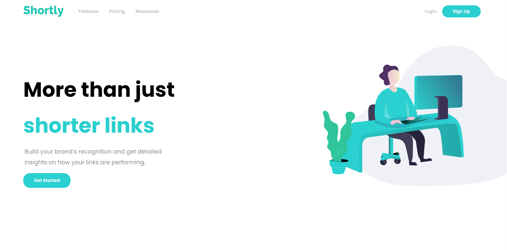

# Shortly

## Welcome! 👋

This is an API project that shortens your long and boring urls

## Lessons Learned

- I learned how to use fetch APIs
- Async await and how they are a better way to use promises

## Mentions

- [Frontend Mentor](https://www.frontendmentor.io/)
- [Harry's Amazing JS course](https://www.youtube.com/playlist?list=PLu0W_9lII9ahR1blWXxgSlL4y9iQBnLpR/)
- [100 Devs](https://www.youtube.com/@learnwithleon)